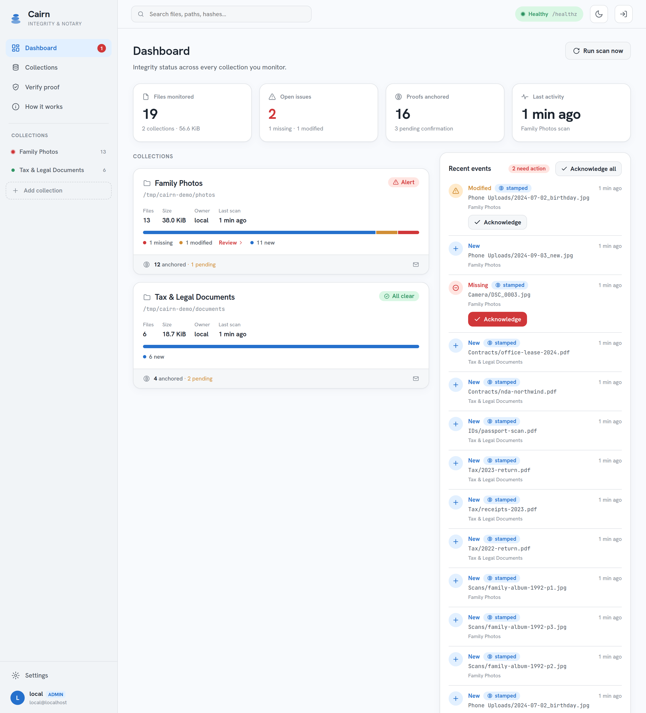
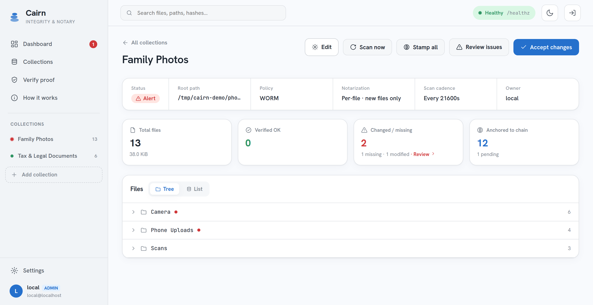
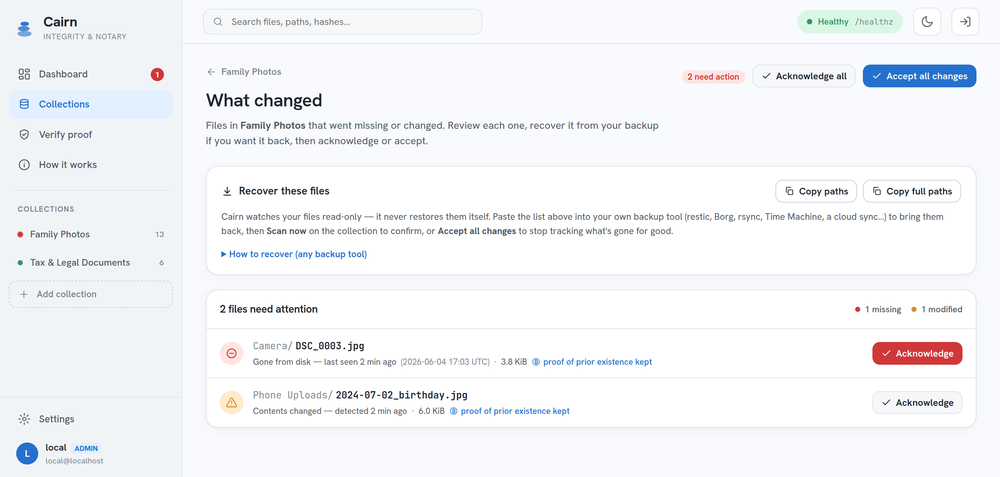
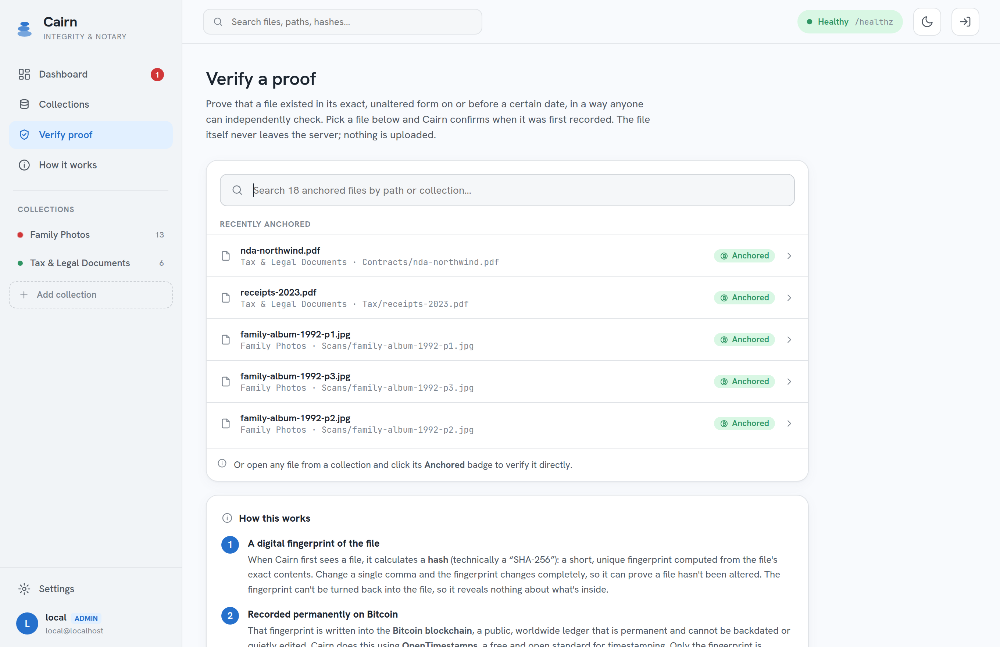
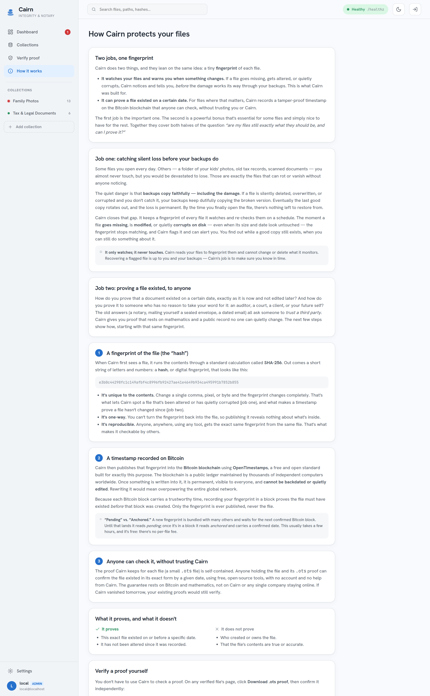

# Cairn

**A self-hosted file-integrity monitor + OpenTimestamps notary, with a web panel.**

Cairn watches your important files for **deletion, modification, and silent corruption**, and
(optionally, per collection) anchors each file's hash to the **Bitcoin blockchain** via
[OpenTimestamps](https://opentimestamps.org) — giving you a trustless, portable proof that a
file *existed, unaltered, by a given date*. SQLite-backed, no external service dependency.

> *Why "Cairn":* a cairn is a stack of stones left as a durable marker — proof something was
> here, that endures (provenance). And if a trail cairn has been knocked over, you notice
> (integrity). Both halves of the product in one word.



> Screenshots use illustrative sample data.

## Status

**Alpha — a working hobby project, Phase 1.** Core monitoring and notarization are built and
running. Honest caveats before you rely on it:

- **Single-user only.** Multi-user login + admin is designed but **not yet shipped** (Phase 2).
  In single-user mode the panel has **no in-app login wall** — see [Deployment](#deployment).
- **Email (SMTP) alerts work.** Webhook, ntfy, Signal (CallMeBot), and Uptime-Kuma heartbeat
  are scaffolded but not yet wired for routing.
- APIs, schema, and CLI may still change. Pin to a commit if you depend on it.

## What it does

- **Monitors collections** — configured file sets, each with its own policy (WORM vs churn,
  scan cadence, exclude globs, optional weekly deep re-hash for bit-rot). Detects added /
  modified / **missing** / moved files and nags until you acknowledge.
- **Notarizes** — stamps file hashes to Bitcoin via OpenTimestamps, runs a daily `upgrade`
  pass to complete proofs, and stores file + `.ots` together for export.
- **Verifies** — a page where anyone can check a file + `.ots` against the blockchain (via a
  block explorer by default, or your own Bitcoin node).
- **Alerts** — per-collection routing; email (SMTP) today, more channels scaffolded. An
  Uptime-Kuma-style `/healthz` freshness check acts as a dead-man's-switch.

## How it works

Both of Cairn's jobs lean on one thing: a tiny **fingerprint** (a SHA-256 hash) of each
file. The fingerprint is unique to the contents — change a single byte and it changes
completely — it's one-way (it reveals nothing about the file), and it's reproducible
(anyone, with any tool, gets the same fingerprint from the same bytes).

**Job one — catching silent loss before your backups do.** The quiet danger with files you
rarely open (old photos, scanned documents, tax records) is that *backups copy faithfully,
including the damage*. If a file is silently deleted, overwritten, or corrupted and you don't
notice, your backups keep copying the broken version until the last good copy rotates out —
and then it's gone. Cairn keeps a fingerprint of every file it watches and re-checks on a
schedule (with an optional weekly deep re-hash to catch on-disk bit-rot whose size and date
look untouched). The moment a fingerprint stops matching, Cairn flags it and can alert you —
while a good copy still exists. **It only watches; it never touches** — watched folders are
mounted read-only, so Cairn cannot modify or delete what it monitors. Recovery is up to you
and your backups; Cairn's job is to make sure you know in time.

**Job two — proving a file existed, to anyone.** For files where proof-of-date matters, Cairn
publishes the fingerprint (never the file) to the **Bitcoin blockchain** via
[OpenTimestamps](https://opentimestamps.org). Because each Bitcoin block carries a trustworthy
time, recording a fingerprint in a block proves the file existed *before* that block — and the
blockchain can't be backdated or quietly edited. Cairn stores a small self-contained `.ots`
proof alongside each file. Anyone holding the file and its `.ots` can confirm it existed in
that exact form by a given date using free, open-source tools — **with no account and no help
from Cairn**. If Cairn vanished tomorrow, existing proofs would still verify.

| It proves | It does **not** prove |
|---|---|
| This exact file existed on or before a specific date | Who created or owns the file |
| It hasn't been altered since it was recorded | That the file's contents are true or accurate |

The two jobs are independent: you can watch files for loss without ever timestamping them, and
turn on timestamping only where proof-of-date matters.

## Screenshots

| Collection detail | What changed (review) |
|---|---|
| [](docs/screenshots/collection-detail.png) | [](docs/screenshots/review.png) |
| Per-collection status, policy, notarization state, and a folder tree. | Every missing/modified file, with recovery guidance and one-click acknowledge. |

| Verify a proof | How it works |
|---|---|
| [](docs/screenshots/verify.png) | [](docs/screenshots/learn.png) |
| Check any tracked file against the blockchain — or hand off the `.ots` for anyone to verify. | The in-app primer explaining both jobs in plain language. |

## Who it's for

- **Family-archive owners** — trustworthy photo "existed-by" dates that beat unreliable EXIF.
- **Small-business document provenance** — tax/legal proofs you can hand a third party.

## Positioning

Integrity monitors (AIDE, Tripwire, `bitrot`) detect change but don't notarize. The
OpenTimestamps client notarizes but doesn't monitor, organize collections, alert, or give you
a UI. **Cairn joins both behind one self-hosted panel.**

## Stack

Python 3.12 · FastAPI / uvicorn · SQLAlchemy async + SQLite (WAL) · Alembic · Jinja2 + htmx +
Tailwind · OpenTimestamps (`ots` CLI). Docker + Traefik or Caddy for deployment.

## Quickstart

Requires Docker. Cairn runs the `ots` CLI as a subprocess (bundled in the image).

```bash
git clone <this-repo> cairn && cd cairn
cp .env.example .env                       # set CAIRN_HOSTNAME, paths, etc.
cp docker-compose.example.yml docker-compose.yml
# edit docker-compose.yml: point the read-only mounts at the folders you want to watch
make deploy                                # build, scan, bring up the panel
```

Or run the CLI directly (see `cairn --help`): `cairn init` → `cairn add-collection` →
`cairn scan` → `cairn verify` / `cairn export`. The web panel is `cairn serve`.

## Deployment

Watched folders are mounted **read-only** (`:ro`) — Cairn physically cannot modify or delete
the bytes it monitors. The SQLite DB and `.ots` proofs live on a separate writable volume.

> ⚠️ **Single-user mode has no login wall.** Do not expose it directly to the internet. Front
> it with a reverse proxy that enforces authentication (the example compose uses Traefik with
> OAuth; Caddy basic-auth/IP-allowlist alternatives are bundled), and keep `/healthz` as the
> only public route for your uptime monitor. In-app multi-user login is Phase 2.

See **[`DEPLOYMENT.md`](./DEPLOYMENT.md)** for the full guide: read-only mounts, reverse-proxy
auth, configuration, migrations, and cron-only operation.

## Documentation

- **[`DEPLOYMENT.md`](./DEPLOYMENT.md)** — how to deploy: read-only mounts, reverse-proxy auth,
  configuration, operations.
- **[`DESIGN.md`](./DESIGN.md)** — full motivation, decisions, architecture, schema, panel
  pages, CLI, deployment modes, and phasing.
- **[`CLAUDE.md`](./CLAUDE.md)** — development working notes (stack, layout, commands).

## License

Licensed under the **[Apache License 2.0](./LICENSE)**.

Cairn invokes the OpenTimestamps client (`ots`) as a separate subprocess; it does **not** link
or import the LGPL-3.0 `opentimestamps`/`opentimestamps-client` libraries into its own code, so
Cairn's source remains under Apache-2.0. If you redistribute the Docker image (which bundles the
`ots` CLI), comply with the LGPL-3.0 terms for that bundled tool.
